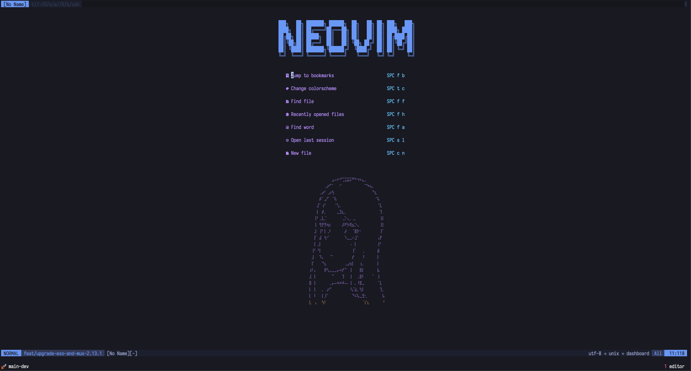
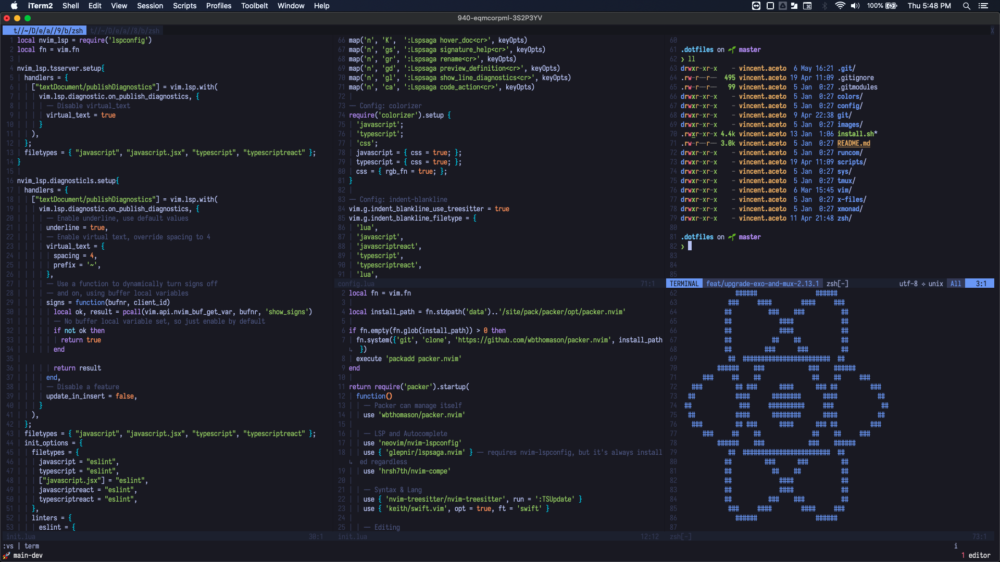

# :computer: Dotfiles

Dotfiles are configuration files that are used to customize and personalize
your system.  The *dotfiles* name comes from the UNIX convention of prefixing
config files with a dot. By default, these files are usually hidden in directory
listings.

This repo contains my very own dotfiles, please feel free to use anything and
everything -- at your own risk :warning:

## Requirements

**Note**: the [installer script](https://github.com/vinnyA3/dotfiles/blob/master/install.sh) will attempt to install the following hard requirements :point_down:
- [gnu stow](https://www.gnu.org/software/stow/) (symlink manager) - avoid having to manually create sym links
- [homebrew](https://brew.sh/) - missing package manager (will install on MacOS only, don't worry)

Please see the *Install* section, directly below, for more information!

## Install

To install with Git:

```bash
    git clone https://github.com/vinnyA3/dotfiles.git ~/.dotfiles &&
      source ~/.dotfiles/install.sh
```

The installer script will attempt to install GNU's *Stow* & the *Homebrew* package
manager (on MacOS). Interestingly enough, homebrew works with linux as well; however, I choose to use the
distro's package manager for the most part (I'll opt to use [Nix package manager](https://github.com/NixOS/nix)) when the
default pkg manager does not have the latest pkg version when I need it). The installer will try to detect
your linux distro; specifically, it will try detect your distro's default package manager.
Right now, the supported linux package managers are:
  * PopOS's & Ubuntu's `apt`
  * Void Linux's `xbps`

Feel free to add other package managers to the script!

## My System Overview

* Current OS(s): [PopOS](https://pop.system76.com/), MacOS -- work machine
* window manager(s):  PopOS's tiling manager, [xmonad](https://xmonad.org/)
* statusbar(s): [polybar](https://github.com/polybar/polybar) - default, xmobar
* theme: [Catppuccin](https://github.com/catppuccin/catppuccin)
* editor: [Neovim](https://neovim.io/) -- check out my Neovim config files [here](https://github.com/vinnyA3/neovim-config)
* shell: [zsh](https://www.zsh.org/) - default, Bash
* terminal emulator(s): [Alacritty](https://github.com/alacritty/alacritty) - default, [ST (Suckless term)](https://st.suckless.org/)
* programs & binaries(installed separately): [fzf](https://github.com/junegunn/fzf), [rg](https://github.com/BurntSushi/ripgrep), [ag](https://github.com/ggreer/the_silver_searcher), node (managed by [nvm](https://github.com/nvm-sh/nvm)) 
  - many, if not all of these programs are utilized by my [Vim](https://github.com/vinnyA3/dotfiles/tree/master/vim) setup
  - :warning: while the legacy vim config lives here, the main neovim configuration
  exists in separate repo: [https://github.com/vinnyA3/neovim-config](https://github.com/vinnyA3/neovim-config)

The core configuration of my development env (zsh, tmux, vim/neovim, helper scripts)
try their best to be OS agnostic; however, there are certain instances where you
just can't get around configuration for the specific platform that you're
working with.  For those cases, the lines are commented in/out in the various config
files.

**Screenshots**





## Additional Resources

* Get started with your own dotfiles 

    Lars Kappart has a great [article](https://medium.com/@webprolific/getting-started-with-dotfiles-43c3602fd789) on dotfiles and how to get them set up. I
    used some of Lar's setup scripts to help with some scaffolding.
