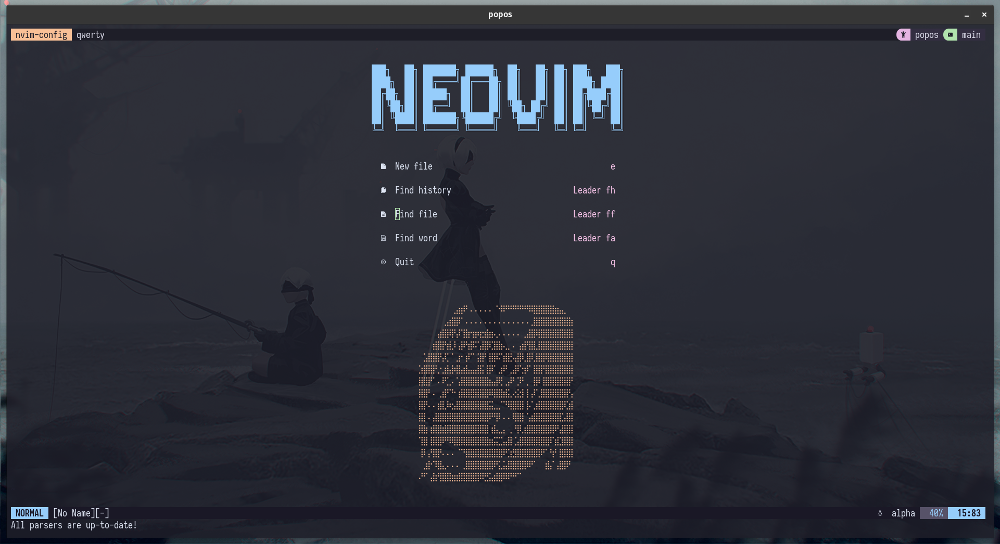

TMUX Configuration
==================

Default prefix: `CTRL + a`

:warning: note: config utilizes external plugin
[tmux-pain-control](https://github.com/tmux-plugins/tmux-pain-control).  Currently, loading is done manually via `tmux.conf`.
However, you can use [tpm](https://github.com/tmux-plugins/tpm) to manage third-party plugins if you prefer.

---

### Theme(s)

This configuration is using a modified **Catppuccin** color theme -- see
`tmux.conf`.

